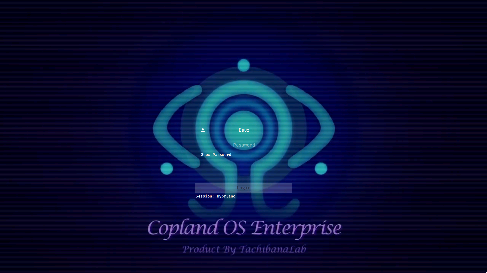

<h2 align="center"> SDDM SEL</h2>

<p align=center>
A SEL inspired theme for the <a href="https://github.com/sddm/sddm">SDDM Login Manager</a>
</p>

<h2 align=center>Preview</h2>


https://github.com/leonardochappuis/sddmsel/assets/40621126/6ec86e78-692d-4a24-b456-1f052c97dd99


<center>


   
</center>

## Install
### From sources
> _Assumes that you've installed and configured SDDM correctly_ (if not [read more](https://wiki.archlinux.org/title/SDDM))

>  Please make sure you have the following dependencies installed:
>  `qt5-quickcontrols2`, `qt5-graphicaleffects`, `qt5-svg`, `qt5-multimedia` 

1. Open terminal, and clone the repository with:

   ```sh
   git clone https://github.com/leonardochappuis/sddmsel.git ~/sddm-sel
   ```

2. Them move it as follows:

   ```sh
   sudo mv ~/sddm-sel /usr/share/sddm/themes/
   ```


## Configure

Edit the `/etc/sddm.conf` (with any text editor with **raised** privileges), so that it looks like this:

```sh
sudo nano /etc/sddm.conf  # use any text editor with raised privileges
---
[Theme]
Current=sddm-sel
   ```

## Credits

- Original Video by [`Skorsen`](https://www.youtube.com/watch?v=zMLNTgomRNk)
- Based on the theme [`Tokyo Night SDDM`](https://github.com/rototrash/tokyo-night-sddm.git) which in turn
is:
- Based on the theme [`Sugar Dark for SDDM`](https://github.com/MarianArlt/sddm-sugar-dark) by [**MarianArlt**](https://github.com/MarianArlt).
- AUR Package by [**julian-poidevin**](https://github.com/julian-poidevin)

## License

[GNU Lesser General Public License v3.0](LICENSE)
